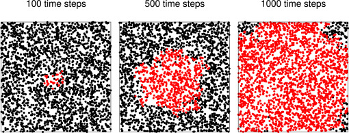

```{r setup, include=FALSE}
knitr::opts_chunk$set(echo = FALSE)

```


```{r}


set.seed(400)
library(ggplot2)

```


```{r}

init_df <-function(STARTING_POPULATION, GRID){
  
  x_coord = rep(NA, STARTING_POPULATION)
  y_coord = rep(NA, STARTING_POPULATION)
  infected = rep(NA, STARTING_POPULATION) # bool value 1 = infected 0 = not infected
  time_infected = rep(0, STARTING_POPULATION)
  dead = rep(NA, STARTING_POPULATION)
  
  for (i in 1:STARTING_POPULATION){
      x_coord[i] = runif(1,0,GRID)
      y_coord[i] = runif(1,0,GRID)
      infected[i] = 0
      dead[i] = 0
  }
  # choose 1 person to be infected, as specified by the paper.
  # locate that person at the center of the grid
  x_coord[i] = GRID/2
  y_coord[i] = GRID/2
  infected[i] = 1
  
  df = as.data.frame(x_coord)
  df$y_coord = y_coord
  df$infected = infected
  df$dead = dead
  df$time_infected = time_infected
  df$time_not_infected = rep(0, STARTING_POPULATION)

  
  df$time_infected[i] = 1
  

  return(df)
}

```


```{r}

update_location <- function(df,population, GRID){

  for (person in 1:population){
    if (df$dead[person] == 0){ # if they are alive and can still move
      df$x_coord[person] = check_bounds(rnorm(1, mean = df$x_coord[person], sd = 0.005), GRID)
      df$y_coord[person] = check_bounds(rnorm(1, mean = df$y_coord[person], sd = 0.005), GRID)
    }
  }
  
  return(df)
  
}


```


```{r}


find_close <- function(x1,y1,x2,y2){
  # euclidean distance formula
  sqrt( (x1-x2)^2 + ( y1-y2)^2)
}

# if a person walks outside of bounds, then they need to be reflected back
check_bounds <- function(x, GRID){
  while(x >= GRID || x <= 0){
  if (x >= GRID){
    x = x - GRID
  }
  
  if (x <= 0){
    x = abs(x)
  }
    
  }
  return(x)

}


```

```{r}

check_infected <- function(df, infection_length = 3, prob_infected = 1, use = FALSE){

  for (person in 1:length(df$dead)){
    if (df$infected[person] == 1){
      for (j in 1:length(df$dead)){
        if (j != person){
          dist = find_close(df$x_coord[person], df$y_coord[person], df$x_coord[j], df$y_coord[j])
          if(dist <= .024){
            if (df$infected[j] != 1 && df$time_not_infected[j] >= 0){
              df$infected[j] = infection(prob_infected) # this is 2 so that a person cannot get infected and infect others in the same 'tick'. (or 0 if they don't get infected)
            }
            
          }
        }
      }
    }
    
  }
  
  df$infected[df$infected == 2] = 1
  df = update_time_infected(df, infection_length, use)
  
  return(df)
  
  
}

```

```{r}

update_time_infected <- function(df, infection_length, use){
  
  if (use == FALSE){
    return(df)
  }
  
  for (i in 1:length(df$x_coord)){
    if (df$infected[i] == 1 && df$time_infected[i] == infection_length){
      df$infected[i] = 0
      df$time_not_infected[i] = -60
    }
    if (df$infected[i] == 1){
      df$time_infected[i] = df$time_infected[i] + 1
    }
    
  }
  
  return(df)
}


infection <- function(prob_infected){
  
  if(rbinom(1,1,prob_infected) == 1){
    return(2)
  }
  
  return(0)
  
}

```


```{r, out.width = "10%"}

set.seed(400)
STARTING_POPULATION = 50
SIMULATION_ITERATIONS = 25
GRID = 0.8


run <- function(STARTING_POPULATION = 1000, SIMULATION_ITERATIONS = 25, GRID = 100, use = TRUE, p){ # Use is to have people recover from infections or not, p = plot infections over time or plot final infected people
  df = init_df(STARTING_POPULATION, GRID)
  num_infections = rep(NA, SIMULATION_ITERATIONS)
  
  for (sim_loop in 1:SIMULATION_ITERATIONS){
    df = update_location(df, STARTING_POPULATION, GRID)
    df = check_infected(df, infection_length = 11, prob_infected = 1, use)
    num_infections[sim_loop] = sum(df$infected)
  }
  
  if (use == FALSE){
    if (p == FALSE){
        tit = paste("Random Walk of COVID-19 infection spread (", SIMULATION_ITERATIONS,  " days)")
        a = ggplot(df,aes(x=x_coord,y=y_coord,group=infected))+
          geom_point(aes(color=as.factor(infected)))+
          labs(title = tit, x = "X Coordinate", y = "Y Coordinate", color = "Infected")
    }
    
    if (p == TRUE){
    tit = paste("Random Walk of COVID-19 infection spread (", SIMULATION_ITERATIONS,  " days)")
    newdf = as.data.frame(num_infections)
    a = ggplot(newdf,aes(x=1:length(num_infections),y = num_infections))+
      geom_line()+
      geom_point()+
      labs(title = tit, x = "Days", y = "Number Infections", color = "Infected")
    }
    
  }
  
  if (use == TRUE){
    tit = paste("Random Walk of COVID-19 infection spread (", SIMULATION_ITERATIONS,  " days)")
    newdf = as.data.frame(num_infections)
    a = ggplot(newdf,aes(x=1:length(num_infections),y = num_infections))+
      geom_line()+
      geom_point()+
      labs(title = tit, x = "Days", y = "Number Infections", color = "Infected")
    
  }
  
  print(a)
  return(num_infections)
  
}

```

## Introduction to Paper

-   We investigated the paper "A random walk Monte Carlo simulation of COVID-19-like infection spread"

-   Paper submitted 2 July, 2020

-   Used early Covid-19 data to predict the spread of Covid

## Lack of Data

-   Paper finished early in the pandemic

-   Little was known about Covid-19 in July

## Random Walk


- A random walk is a process that describes a path of succession in space 

- Use previous , position of the person and a random variable to move the person

- We can use this movement to graph interactions between people


```{r, echo=FALSE, width = "50%"}

knitr::include_graphics("gif.gif", dpi = NULL)

```


## Model Overview

- Set patient 0 at the center of the population

- Used a random walk for each person

- If a healthy person is within 2 meters of an infected person, they got infected


## Their Model Results

- This is a model of the infection spread of New York City

  - Each dot represents a person
  
  - Dots are close together to represent a dense urban area
  
- We can think of the time step as a day


```{r echo=FALSE, out.width = "30%"}

```


## Our Recreation


- Although we do not have the exact same code, and are the paper did not publish their set seed

- We are able to get a similar pattern

- Were not able to use as many people because of computational limitations

```{r,fig.keep = 'last', echo = FALSE, results='hide'}


run(STARTING_POPULATION = 1000, SIMULATION_ITERATIONS = 10, GRID, use = FALSE, p = FALSE)


```

```{r,fig.keep = 'last', echo = FALSE, results='hide'}


run(STARTING_POPULATION = 1000, SIMULATION_ITERATIONS = 25, GRID, use = FALSE, p = FALSE)

```
```{r, echo = FALSE, results = 'hide'}

plot_both <- function(tempdf){
  tit = paste("Random Walk of COVID-19 infection spread (", length(recover),  " days)")
  a = ggplot(tempdf)+
    geom_line(aes(x=1:length(recover),y = recover, color = "With Recovery"))+
    geom_point(aes(x=1:length(recover),y = recover), color = "red")+
    geom_line(aes(x = 1:length(recover), y = no_recover,color = "Without Recovery"))+
    geom_point(aes(x = 1:length(recover), y = no_recover), color = "blue")+
    labs(title = tit, x = "Days", y = "Number Infections", color = c("recover", "not recover"))

  return(a)
}
```

```{r,fig.keep = 'last', echo = FALSE, results='hide'}

run(STARTING_POPULATION = 1000, SIMULATION_ITERATIONS = 50, GRID, use = FALSE, p = FALSE)

```


## COVID-19 Infections with Recovery

- Original Paper did not have any recoveries

- We assumed each person would recover after 11 days


```{r,fig.keep = 'last', echo = FALSE, results='hide'}

 GRID = 0.8
 set.seed(400)
 no_recover = run(STARTING_POPULATION = 1000, SIMULATION_ITERATIONS = 25, GRID, use = FALSE, p = TRUE)
 set.seed(400)
 recover = run(STARTING_POPULATION = 1000, SIMULATION_ITERATIONS = 25, GRID, use = TRUE, p = TRUE)
 tempdf = as.data.frame(no_recover)
 tempdf$recover = recover
 plot_both(tempdf)

```


## Our Model

```{r,fig.keep = 'last', echo = FALSE, results='hide'}
set.seed(400)
no_recover = run(STARTING_POPULATION = 1000, SIMULATION_ITERATIONS = 50, GRID, use = FALSE, p = TRUE)
set.seed(400)
recover = run(STARTING_POPULATION = 1000, SIMULATION_ITERATIONS = 50, GRID, use = TRUE, p = TRUE)
tempdf = as.data.frame(no_recover)
tempdf$recover = recover

plot_both(tempdf)


```


```{r,fig.keep = 'last', echo = FALSE, results='hide'}
set.seed(400)
no_recover = run(STARTING_POPULATION = 1000, SIMULATION_ITERATIONS = 75, GRID, use = FALSE, p = TRUE)
set.seed(400)
recover = run(STARTING_POPULATION = 1000, SIMULATION_ITERATIONS = 75, GRID, use = TRUE, p = TRUE)
tempdf = as.data.frame(no_recover)
tempdf$recover = recover

plot_both(tempdf)


```


```{r, out.width = "30%", fig.cap = "New York Real Life Covid Cases"}
knitr::include_graphics("New York Covid.PNG")
```


## Colorado Real Life Cases

- Using data from Colorado to use parameters like transmission rate and recovery rate. 

- Took an average for transmission rate based on 25 simulations in data.

- Found the transmission rate to be 0.47

- A person recovers every 8 days


```{r}
set.seed(400) 
#colorado stuff
check_infected_co <- function(df, infection_length = 8, prob_infected = 0.47, use = FALSE){

  for (person in 1:length(df$dead)){
    if (df$infected[person] == 1){
      for (j in 1:length(df$dead)){
        if (j != person){
          dist = find_close(df$x_coord[person], df$y_coord[person], df$x_coord[j], df$y_coord[j])
          if(dist <= .024){
            if (df$infected[j] != 1 && df$time_not_infected[j] >= 0){
              df$infected[j] = infection(prob_infected) # this is 2 so that a person cannot get infected and infect others in the same 'tick'. (or 0 if they don't get infected)
            }
            
          }
        }
      }
    }
    
  }
  
  df$infected[df$infected == 2] = 1
  df = update_time_infected_co(df, infection_length, use)
  
  return(df)
  
  
}

update_time_infected_co <- function(df, infection_length, use){
  
  if (use == FALSE){
    return(df)
  }
  
  for (i in 1:length(df$x_coord)){
    if (df$infected[i] == 1 && df$time_infected[i] == infection_length){
      df$infected[i] = 0
      df$time_not_infected[i] = -60
    }
    if (df$infected[i] == 1){
      df$time_infected[i] = df$time_infected[i] + 1
    }
    
  }
  
  return(df)
}


infection <- function(prob_infected = 0.47){
  
  if(rbinom(1,1,prob_infected) == 1){
    return(2)
  }
  return(0)
  
  
}


run_co <- function(STARTING_POPULATION = 1000, SIMULATION_ITERATIONS = 1000, GRID = 100, use = TRUE, p){ # Use is to have people recover from infections or not, p = plot infections over time or plot final infected people
  df = init_df(STARTING_POPULATION, GRID)
  num_infections = rep(NA, SIMULATION_ITERATIONS)
  
  for (sim_loop in 1:SIMULATION_ITERATIONS){
    df = update_location(df, STARTING_POPULATION, GRID)
    df = check_infected_co(df, infection_length = 8, prob_infected = 0.47, use)
    num_infections[sim_loop] = sum(df$infected)
  }
  
  if (use == FALSE){
    if (p == FALSE){
        tit = paste("Random Walk of COVID-19 infection spread (", SIMULATION_ITERATIONS,  " days)")
        a = ggplot(df,aes(x=x_coord,y=y_coord,group=infected))+
          geom_point(aes(color=as.factor(infected)))+
          labs(title = tit, x = "X Coordinate", y = "Y Coordinate", color = "Infected")
        }
    if (p == TRUE){
    tit = paste("Random Walk of COVID-19 infection spread (", SIMULATION_ITERATIONS,  " days)")
    newdf = as.data.frame(num_infections)
    a = ggplot(newdf,aes(x=1:length(num_infections),y = num_infections))+
      geom_line()+
      geom_point()+
      labs(title = tit, x = "Days", y = "Number Infections", color = "Infected")
    }
    
  }
  
  if (use == TRUE){
    tit = paste("Random Walk of COVID-19 infection spread (", SIMULATION_ITERATIONS,  " days)")
    newdf = as.data.frame(num_infections)
    a = ggplot(newdf,aes(x=1:length(num_infections),y = num_infections))+
      geom_line()+
      geom_point()+
      labs(title = tit, x = "Days", y = "Number Infections", color = "Infected")
    
  }

  
  print(a)

  
  return(num_infections)

}


plot_both_2 <- function(tempdf){
  tit = paste("Random Walk of COVID-19 infection spread (", length(recover),  " days)")
  a = ggplot(tempdf)+
    geom_line(aes(x=1:length(recover),y = recover, color = "Without Recovery"))+
    geom_point(aes(x=1:length(recover),y = recover), color = "red")+
    geom_line(aes(x = 1:length(recover), y = no_recover,color = "With Recovery"))+
    geom_point(aes(x = 1:length(recover), y = no_recover), color = "blue")+
    labs(title = tit, x = "Days", y = "Number Infections", color = c("recover", "not recover"))

  return(a)
}
```


## Colorado Real Cases

- Use Monte Carlo to compute 180 iterations of the simulation. 

- With a starting population of 1000, we can see the spread of Covid-19.

- Without a recovery rate we see that all of the people become infected around day 125.

- With a recovery rate we see that the spread would eventually stop around day 150.


```{r,fig.keep = 'last'}

 no_recover = run_co(STARTING_POPULATION = 1000, SIMULATION_ITERATIONS = 180, GRID = 0.8, use = FALSE, p = TRUE)
 set.seed(400)
 recover = run_co(STARTING_POPULATION = 1000, SIMULATION_ITERATIONS = 180, GRID = 0.8, use = TRUE, p = TRUE)
 codf = as.data.frame(no_recover)
 codf$recover = recover
 plot_both_2(codf)
 
```


## Colorado Data

- There are limitations to the Colorado data considering that we did not implement a vaccination.

- This data was also taken from when Covid-19 was not considered an epidemic anymore.

- Still useful to predict how safety measures could impact the spread of the virus.

- Also helpful when determining the length of infections for the virus.


## Conclusions

- We were able to replicate the study for a random walk with monte carlo simulations and implement a recovery rate.

- From there we used MC simulations to estimate the spread of Covid-19 for other places like New York City and Colorado.

- Our models could be improved further by varying probabilities by age or using social distancing measures, but adding in a recovery rate improves the original study.


